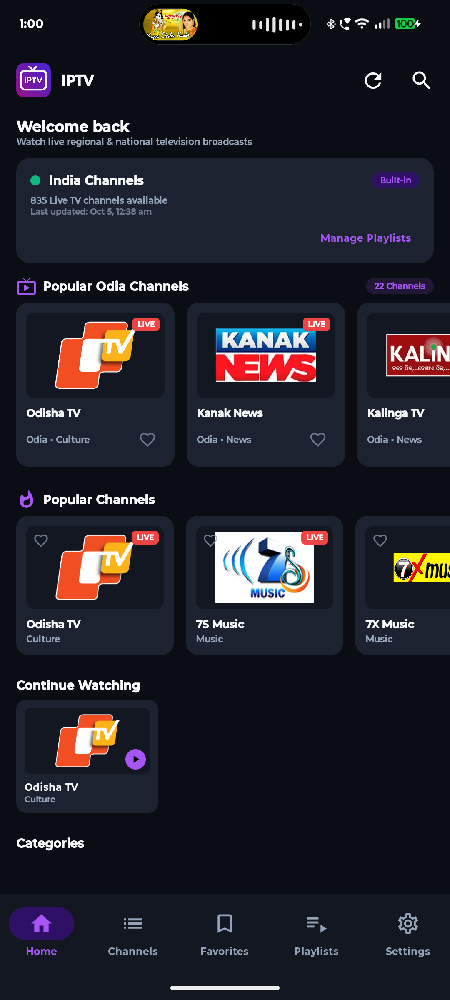
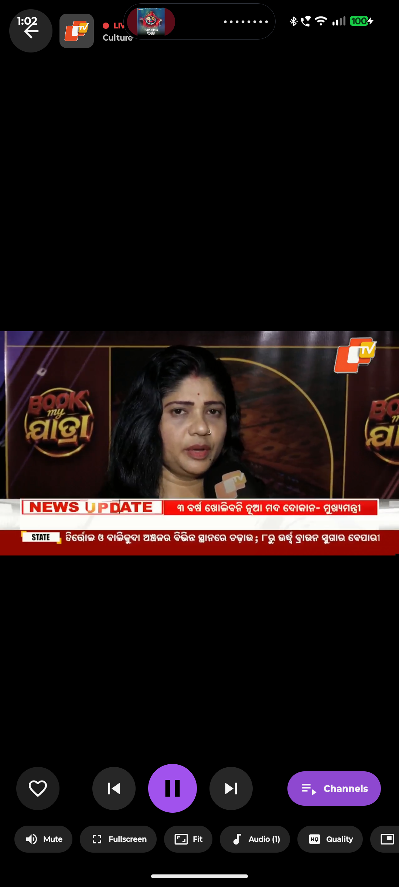
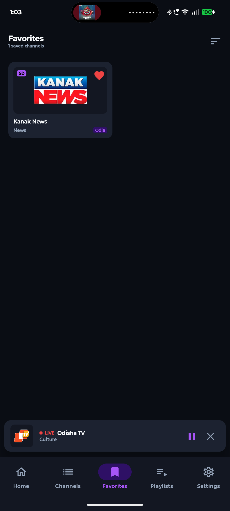
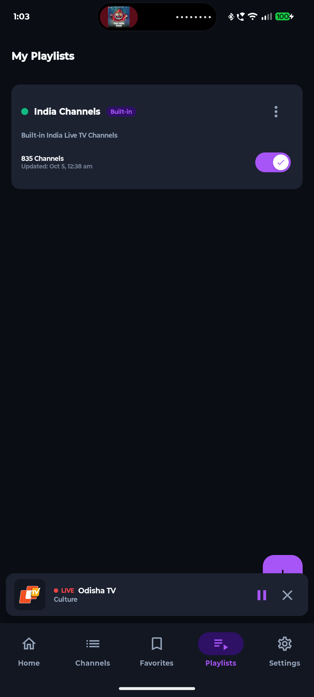
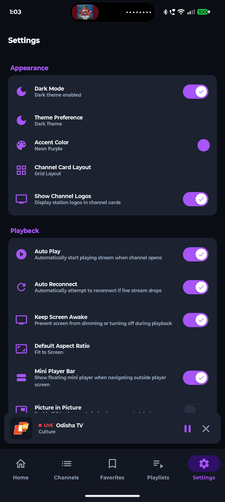

# IPTV Android App

### imagine that u can show live tv channels all over the world specifically india bu default in ur phone without any subscription yes its possible using IPTV.

## How to Install

1. Download the APK file on your Android phone from [Direct APK Download](https://github.com/dev-prabina/android-app/releases/download/v1.0.0/app-debug.apk).
2. Open the downloaded APK file.
3. If your phone asks, allow "Install unknown apps" from your browser or file manager settings.
4. Tap **Install**.
5. Once installed, tap **Open**.
6. Enjoy watching live TV channels directly on your phone!

You can also scan the QR code below using your mobile camera or Google Lens to download the APK directly.

## Download QR Code

Scan this QR code with your phone to download the app:

Direct download link:
[https://github.com/dev-prabina/android-app/releases/download/v1.0.0/app-debug.apk](https://github.com/dev-prabina/android-app/releases/download/v1.0.0/app-debug.apk)

## About the App

This app is a simple and fast IPTV player for Android phones.

It loads live TV channels from standard IPTV / M3U playlists and plays live streams smoothly.

Key details:
* The app comes with an India channel playlist by default with 800+ live channels.
* Users can easily add their own IPTV / M3U playlists or stream links.
* The app does not host any TV videos or contents itself. It plays the public stream links provided by the playlist.

## Advantages

* **Easy to use**: Clean and beginner-friendly design.
* **Fast channel loading**: Channels and logos load quickly with offline caching.
* **Channel search**: Quickly search any channel by name, category, or language.
* **Popular Odia channels section**: Dedicated section for popular regional Odia channels right on the Home screen.
* **Favorites**: Save your favorite channels with one tap for quick access.
* **Custom IPTV playlists**: Add and switch between multiple M3U playlists easily.
* **Playlist management**: Refresh, enable, or manage playlists anytime.
* **Full-screen video player**: Seamless video playback with aspect ratio controls (Fit, Fill, Zoom).
* **Video controls**: Polished bottom control bar with Play/Pause, Channel navigation, Mute, and Lock.
* **Picture-in-Picture (PiP)**: Keep watching TV in a floating mini window while using other apps.
* **Dark mode and Light mode**: Fully supports both dark and light themes with smooth switches.
* **Modern UI**: Built with modern Jetpack Compose for smooth animations and responsiveness.
* **Android phone support**: Works smoothly across all modern Android devices.
* **Cached playlist information**: Stores channel data locally in a database so it opens instantly without re-downloading every time.
* **Easy channel browsing**: Browse channels sorted by categories like News, Entertainment, Movies, Music, and Sports.

## Screenshots

### Home

### Video Player

### Favorites

### Playlists

### Settings

## About the Developer

This app is developed by Prabina Kumar Sahu.

I am interested in Android development, networking, OpenWrt, and new technology.

GitHub:
[https://github.com/dev-prabina](https://github.com/dev-prabina)
